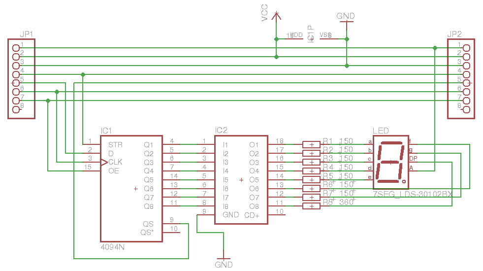

# z7seg_led library for Arduino

This is a library to control 7-segment displays using SPI and 74hc595/74hc4094 shift registers.

## Hardware

The following are needed

* Any arduino board
* Shift register, 74hc595 and 74hc4094 are currently supported
* 7-segment led display
* Transistor array or pack of transistors
* Current-limiting resistors

### Example
This is a wiring diagram for connecting one or more display via 74hc4094 IC:

Connection:

Arduino        |    74HC4094
---------------|-------------
MOSI (11)      |    D    ( 2)
SCK  (13)      |    CLK  ( 3)
OE   ( 9, PWM) |    OE   (15)
CE   ( 8)      |    STR  ( 1)
VCC            |    MR   (10)

<pre><code>
#include &lt;z7seg_led.h&gt;
#include &lt;SPI.h&gt;

const int CE = 8;
const int OE = 9;

z7seg_led display(OE, CE);

void setup() {
    SPI.begin();
    display.begin();
    display.set_type(z7seg_led_74hc4094);
}

void loop()
{
    static int i = 0;

    display.begin_transfer();
    display.send_digit(i++);
    display.end_transfer();

    if (i >= 10) {
        i = 0;
    }

    delay(250);
}
</code></pre>

## Contributors

Written by Pershin Sergey

*This library is free software; you can redistribute it and/or modify it under the terms of the GNU Lesser General Public License as published by the Free Software Foundation; either version 3.0 of the License, or (at your option) any later version.*

